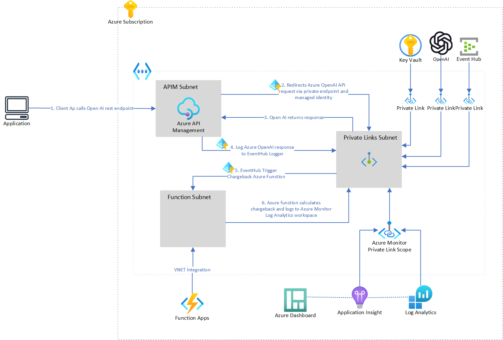
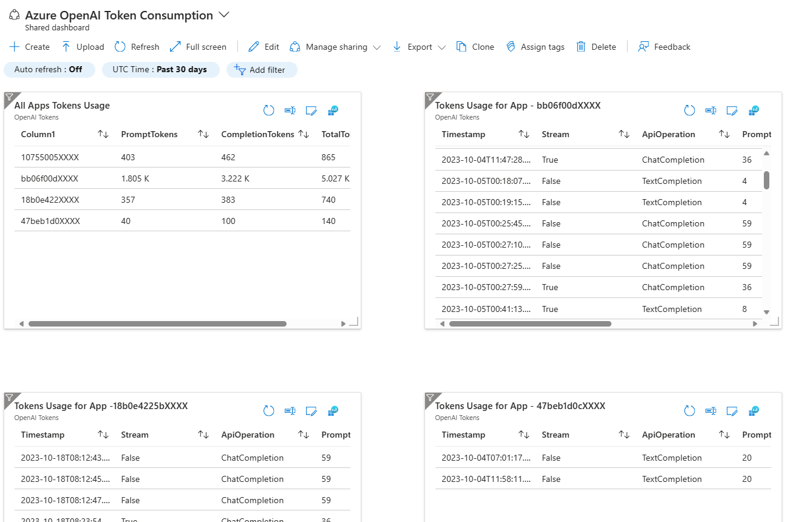

# Azure OpenAI with Azure API Management and Private Link for Chargeback

## Table of Contents


  - [Overview](#overview)
  - [Benefits](#benefits)
  - [Application architecture](#application-architecture)
  - [Getting Started](#getting-started)
    - [Account Requirements](#account-requirements)
    - [Deploy to Azure](#deploy-to-azure)
      - [Pre-requisite - Azure Developer CLI](#pre-requisite---azure-developer-cli)
      - [Deploy to Azure to existing Resource Group](#deploy-to-azure-to-existing-resource-group)
      - [Deploying again](#deploying-again)
      - [Clean up](#clean-up)
  - [Testing the solution](#testing-the-solution)
    - [Completion](#completion)
    - [Chat Completion](#chat-completion)
  - [Azure Monitor queries to extract tokens usage metrics](#azure-monitor-queries-to-extract-tokens-usage-metrics)
  - [Additional Details](#additional-details)
    - [Azure OpenAI Swagger Specification](#azure-openai-swagger-specification)
    - [Tiktoken](#tiktoken)


## Overview

This sample demonstrates hosting Azure OpenAI (AOAI) instance privately within (customer's) Azure tenancy and publishing AOAI via Azure API Management (APIM). 
APIM plays a key role to montior and govern all the requests routed towards Azure OpenAI. Customer gets full control on who gets to access the AOAI and ability to charge back the AOAI users. 

The repo includes: 
1. Infrastructure as Code (Bicep templates) to provision Azure resources for Azure OpenAI, Azure API Management, Azure Event Hub and Azure Function App and Azure Private Links configuration. 

2. A function app that computes token usage across various consumers of the Azure OpenAI service. This implementation utilizes the Tokenizer package and computes token usage for both streaming and non-streaming requests to Azure OpenAI endpoints.

3. Test scripts to test OpenAI chat and chat completions endpoints in Azure API Management using powershell or shell scripts.

## Benefits

1. *Private*: Azure OpenAI Private Endpoints guarantees that data transmission remains protected from public internet exposure. By creating a private connection, Azure OpenAI Private Endpoints offer a secure and effective pathway for transmitting data between your infrastructure and the OpenAI service, thereby reducing potential security risks commonly associated with conventional public endpoints. Network traffic can be fully isolated to your network and other enterprise grade authentication security features are built in.
2. *Centralised and Secure Access*: By integrating Azure OpenAI with Azure API Management (APIM) through Private Endpoints, you can secure access to Azure OpenAI and oversee access control. Furthermore, you have the ability to monitor service usage and health. Additionally, access to the Azure OpenAI service is also regulated via API Keys to authenticate and capture OpenAI usage.
3. *Out of the box Token Usage Solution*: The solution offers sample code for Azure functions that compute token usage across various consumers of the Azure OpenAI service. This implementation utilizes the Tokenizer package and computes token usage for both streaming and non-streaming requests to Azure OpenAI endpoints.
4. *Policy as Code*: Using Azure APIM policies to configure access control, throttling loging and usage limits. It uses APIM log-to-eventhub policy to capture OpenAI requests and responses and sends it to the chargeback solution for calculation.
5. *End-to-end observability for applications*: Azure Monitor provides access to application logs via Kusto Query Language. Also enables dashboard reports and monitoring and alerting capabilities.
6. *Larger Token Size*: The advanced logging pattern permits capturing an event of up to 200KB, whereas the basic logging pattern accommodates a maximum size of 8,192 bytes. This feature facilitates capturing prompts and responses from models that accommodate larger token sizes, such as GPT4.
7. *Robust identity controls and comprehensive audit logging*: Access to the Azure OpenAI Service resource is limited to Azure Active Directory identities, including service principals and managed identities. This is achieved through the implementation of an Azure API Management custom policy. The logs streaming to the Azure Event Hub capture the identity of the application initiating the request.
8. *Send token usage data to diverse reporting and analytical tools*: Azure APIM sends usage data to an Azure Event Hub. These events can be subsequently processed through integration with Azure Stream Analytics and then routed to data stores, including Azure SQL, Azure CosmosDB, or a PowerBI Dataset.

## Application architecture

1. Client Application requests the `completions` or `chat completions` endpoints of Azure OpenAI Service in Azure API Management.
_Client App has to pass a valid subscription key in the request header. Azure APIM validates the subscription key and returns an Unauthorized error response if an invalid subscription key is passed._
2. If the request is valid, Azure API Management authenticates with OpenAI service using managed identity and forwards the request to Azure OpenAI Service via private link.
3. Azure OpenAI Service responds back to Azure API Management using private link.
4. Azure API Management logs the request and response data to an event hub using `log-to-eventhub` policy in APIM. APIM authenticates with EventHub using Managed Identity and sends the log data via private link.
5. `ChargebackEventHubTrigger` Azure Function is triggered when the message arrives in Event Hub from APIM. It calculates prompt and completion token counts. 
_For streaming requests, it uses [Tiktoken](#tiktoken) library to calculate tokens. For non-streaming requests, it uses the token count data returned in the response from OpenAI service._
6. Azure Function logs the token usage data to Application Insights. Once the data is in Log Analytics workspace for Application insights, it can be queried to get tokens count for the client applications. 
_View sample queries: [Token Usage Queries](#azure-monitor-queries-to-extract-tokens-usage-metrics)_




## Getting Started

### Account Requirements

In order to deploy and run this example, you'll need

* **Azure account**. If you're new to Azure, [get an Azure account for free](https://azure.microsoft.com/free/cognitive-search/) and you'll get some free Azure credits to get started.
* **Azure subscription with access enabled for the Azure OpenAI service**. You can request access with [this form](https://aka.ms/oaiapply). If your access request to Azure OpenAI service doesn't match the [acceptance criteria](https://learn.microsoft.com/legal/cognitive-services/openai/limited-access?context=%2Fazure%2Fcognitive-services%2Fopenai%2Fcontext%2Fcontext), you can use [OpenAI public API](https://platform.openai.com/docs/api-reference/introduction) instead. Learn [how to switch to an OpenAI instance](#switching-from-an-azure-openai-endpoint-to-an-openai-instance).
* **Azure account permissions**: Your Azure account must have `Microsoft.Authorization/roleAssignments/write` permissions, such as [Role Based Access Control Administrator](https://learn.microsoft.com/azure/role-based-access-control/built-in-roles#role-based-access-control-administrator-preview), [User Access Administrator](https://learn.microsoft.com/azure/role-based-access-control/built-in-roles#user-access-administrator), or [Owner](https://learn.microsoft.com/azure/role-based-access-control/built-in-roles#owner). If you don't have subscription-level permissions, you must be granted [RBAC](https://learn.microsoft.com/azure/role-based-access-control/built-in-roles#role-based-access-control-administrator-preview) for an existing resource group and [deploy to that existing group](#existing-resource-group).

### Deploy to Azure

#### Pre-requisite - Azure Developer CLI
1. Download the [Azure Developer CLI](https://learn.microsoft.com/en-us/azure/developer/azure-developer-cli/overview)
1. If you have not cloned this repo, run `azd init -t microsoft/enterprise-azureopenai`. If you have cloned this repo, just run 'azd init' from the repo root directory.

Execute the following command, if you don't have any pre-existing Azure services and want to start from a fresh deployment.

1. Run `azd auth login`
2. If your account has multiple subscriptions, run `azd env set AZURE_SUBSCRIPTION_ID {Subscription ID}` to set the subscription you want to deploy to.
3. If you would like to give a custom name to the resource group, run `azd env set AZURE_RESOURCE_GROUP {Name of resource group}`. If you don't set this, resource group will be named `rg-enterprise-openai-${environmentName}`.
4. Run `azd up` - This will provision Azure resources and deploy this sample to those resource
5. After the application has been successfully deployed you will see a URL printed to the console.  Click that URL to interact with the application in your browser.
It will look like the following:


> **Important** 
> If you are running ```azd up``` for the first time, it may take upto 45 minutes for the application to be fully deployed as it it needs to wait for the Azure API Management to be fully provisioned. Subsequent deployments are a lot faster. You can check the status of the deployment by running `azd status`.


### Deploy to Azure to existing Resource Group

If you already have existing Azure resources, you can re-use those by setting `azd` environment values.

1. [OPTIONAL]: RUN `azd env set AZURE_SUBSCRIPTION_ID {Subscription ID}` if your account has multiple subscriptions and you want to deploy to a specific subscription.
1. Run `azd env set AZURE_RESOURCE_GROUP {Name of existing resource group}`
2. Run `azd env set AZURE_LOCATION {Location of existing resource group}`

### Deploying again

If you've only changed the function app code in the `app` folder, then you don't need to re-provision the Azure resources. You can just run:

```azd deploy```

If you've changed the infrastructure files (`infra` folder or `azure.yaml`), then you'll need to re-provision the Azure resources. You can do that by running:

```azd up```

### Clean up

To clean up all the resources created by this sample:

1. Run `azd down`
2. When asked if you are sure you want to continue, enter `y`
3. When asked if you want to permanently delete the resources, enter `y`

The resource group and all the resources will be deleted.

## Testing the solution

- Update the variables in the test script files with API Management service name `apimServiceName` and subscription key `apimSubscriptionKey`.
- To test OpenAI endpoints with stream enabled, update the value of `stream` variable to `true` in the test script files.

### Completion

1. Shell
    ```./test-scripts/testcompletions.sh ```
    <br>
2. Powershell
    ```./test-scripts/testcompletions.ps1```

### Chat Completion

1. Shell
    ```./test-scripts/testchatcompletions.sh``` 
    <br>
2. Powershell
    ```./test-scripts/testchatcompletions.ps1```


## Azure Monitor queries to extract tokens usage metrics

- Once the Chargeback functionapp calculates the prompt and completion tokens per OpenAI request, it logs the information to Azure Log Analytics. 
- All custom logs from function app is logged to a table called `customEvents`

- Example query to fetch token usage by a specific client key:
```kusto
customEvents
| where name contains "Azure OpenAI Tokens"
| extend tokenData = parse_json(customDimensions)
| where tokenData.AppKey contains "your-client-key"
| project    
    Timestamp = tokenData.Timestamp,
    Stream = tokenData.Stream,
    ApiOperation = tokenData.ApiOperation,    
    PromptTokens = tokenData.PromptTokens,
    CompletionTokens = tokenData.CompletionTokens,
    TotalTokens = tokenData.TotalTokens
```

- Example query to fetch token usage for all consumers
```kusto
customEvents
| where name contains "Azure OpenAI Tokens"
| extend tokenData = parse_json(customDimensions)
| extend
    AppKey = tokenData.AppKey,
    PromptTokens = tokenData.PromptTokens,
    CompletionTokens = tokenData.CompletionTokens,
    TotalTokens = tokenData.TotalTokens
| summarize PromptTokens = sum(toint(PromptTokens)) , CompletionTokens = sum(toint(CompletionTokens)), TotalTokens = sum(toint(TotalTokens)) by tostring(AppKey)
| project strcat(substring(tostring(AppKey),0,8), "XXXX"), PromptTokens, CompletionTokens, TotalTokens
```

The queries can be visualised using Azure Dashboards


## Additional Details

### Azure OpenAI Swagger Specification

[Azure OpenAI Swagger Spec](https://github.com/Azure/azure-rest-api-specs/blob/main/specification/cognitiveservices/data-plane/AzureOpenAI/inference/stable/2023-05-15/inference.json) is imported in Azure API Management.

### Tiktoken

[Tiktoken](https://www.nuget.org/packages/Tiktoken/1.1.2#show-readme-container) library is used to calculate tokens when "stream" is set as "true" to stream back partial progress from GPT models. 
*If `stream` is set, partial message deltas will be sent, Tokens will be sent as data-only server-sent events as they become available, with the stream terminated by a data: [DONE] message.*


# Contributing

This project welcomes contributions and suggestions. Most contributions require you to agree to a
Contributor License Agreement (CLA) declaring that you have the right to, and actually do, grant us
the rights to use your contribution. For details, visit https://cla.opensource.microsoft.com.

When you submit a pull request, a CLA bot will automatically determine whether you need to provide
a CLA and decorate the PR appropriately (e.g., status check, comment). Simply follow the instructions
provided by the bot. You will only need to do this once across all repos using our CLA.

This project has adopted the [Microsoft Open Source Code of Conduct](https://opensource.microsoft.com/codeofconduct/).
For more information see the [Code of Conduct FAQ](https://opensource.microsoft.com/codeofconduct/faq/) or
contact [opencode@microsoft.com](mailto:opencode@microsoft.com) with any additional questions or comments.

# Trademarks

This project may contain trademarks or logos for projects, products, or services. Authorized use of Microsoft
trademarks or logos is subject to and must follow
[Microsoft's Trademark & Brand Guidelines](https://www.microsoft.com/en-us/legal/intellectualproperty/trademarks/usage/general).
Use of Microsoft trademarks or logos in modified versions of this project must not cause confusion or imply Microsoft sponsorship.
Any use of third-party trademarks or logos are subject to those third-party's policies.


